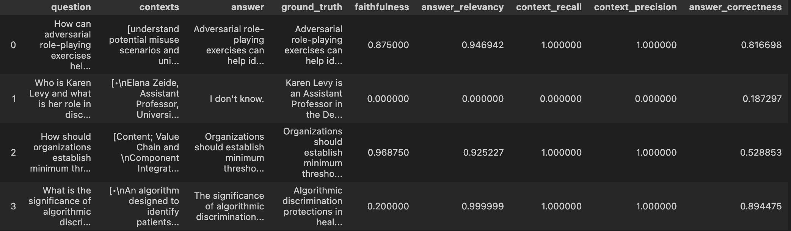
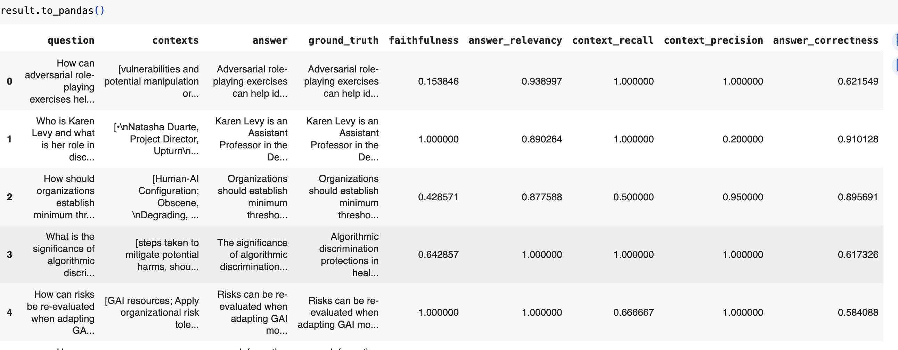
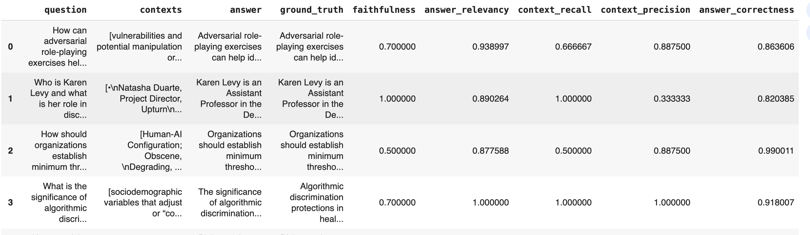
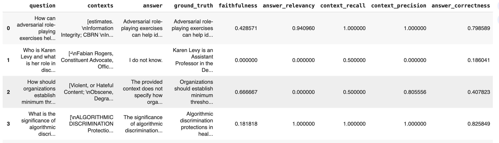
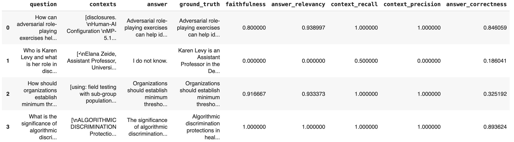
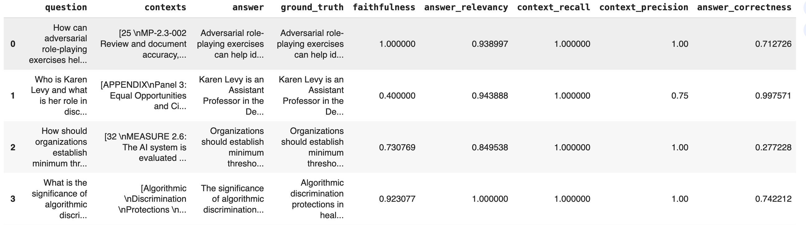

# Task 1: Dealing with the Data
Review the two PDFs and decide how best to chunk up the data with a single strategy to optimally answer the variety of questions you expect to receive from people.

Deliverables:
1. Describe the default chunking strategy that you will use.
    - I chose the chunk by length (i.e., specify CHUNK_SIZE,CHUNK_OVERLAP)
2. Articulate a chunking strategy that you would also like to test out.
    - Chunk by section/paragraph
3. Describe how and why you made these decisions
    - I picked 10 random piece of chunks and generated 2 questions per chunk - This will the "ground truth"
    - Then I created 2 retrievers based on different chunk size (500 VS 1000), along with a retriever that is based on text split by section/paragraph
    - Ran through generated questions and calculate the "is_hit" rate (i.e., if retriever retrieved correct chunk, then 1 else 0)
    - Ideally ran it multiple times (since our questions are randomly generated) and check the mean "is_hit" rate
    - I ran it couple time, in general chunk_size = 1000 and overlap = 200 always gives the but resutls

# Task 2: Building a Quick End-to-End Prototype
Build an end-to-end RAG application using an industry-standard open-source stack and your choice of commercial off-the-shelf models
Deliverables:
1. Build a live public prototype on Hugging Face, and include the public URL link to your space.
    - https://huggingface.co/spaces/yinong333/ChatwithLegalPDF

2. How did you choose your stack, and why did you select each tool the way you did?
    - Qdrant
        - Qdrant is a fully-fledged vector database that speeds up the search process by using a graph-like structure to find the closest objects in sublinear time. So we don’t calculate the distance to every object from the database, but some candidates only. It uses Hierarchical Navigable Small World (HNSW) algorithm so we are able to compare the distance to some of the objects from the database, not to all of them. This allows a fast response
    - Langchain
        - LangChain provides a comprehensive framework designed specifically for building conversational AI applications. It abstracts many complex aspects of developing these applications, such as document retrieval, context management, and conversational memory and allows user to define and customize chains of operations, which are sequences of steps that process user input, retrieve relevant information, and generate responses. LangChain integrates seamlessly with vector databases like Qdrant, facilitating efficient document retrieval based on semantic search. This is crucial for applications that need to fetch and utilize large volumes of document-based data dynamically. It also supports embeddings and vector search, crucial for building efficient, AI-driven search and retrieval systems within conversational applications.
    - OpenAI:
        - OpenAI offers some of the most advanced language models available, such as GPT-3.5. These models are pre-trained on a diverse range of internet text, making them highly capable of understanding and generating human-like text. OpenAI’s infrastructure is designed to handle high request volumes, ensuring that our application can scale seamlessly as user demand increases. It provides easy-to-use APIs for integrating their language models into applications. This simplifies the development process and allows you to focus on application-specific functionalities rather than the complexities of model training and maintenance.
    - Chainlit:
        - Chainlit offers a variety of features and advantages that can be particularly beneficial when building interactive, data-driven web applications, especially for AI and machine learning models. It requires less boilerplate code compared to traditional web development frameworks, which can significantly speed up development time. It also provides out-of-the-box UI components that are pre-configured to work well with data-driven applications, reducing the need to develop these components from scratch. Chainlit facilitates easy handling of streaming data, making it ideal for applications that need to display or process real-time information.

# Task 3: Creating a Golden Test Data Set
Generate a synthetic test data set and baseline an initial evaluation
Deliverables:
1. Assess your pipeline using the RAGAS framework including key metrics faithfulness, answer relevancy, context precision, and context recall.  Provide a table of your output results.
    - I generated 20 synthetic questions, the overal scores are: {'faithfulness': 0.8481, 'answer_relevancy': 0.9196, 'context_recall': 0.8833, 'context_precision': 0.8819, 'answer_correctness': 0.6919}
    - 
2. What conclusions can you draw about performance and effectiveness of your pipeline with this information?
    - I think overall, both based on the generation part and the retrieval part, the performance is pretty ok

# Task 4: Fine-Tuning Open-Source Embeddings
Generate synthetic fine-tuning data and complete fine-tuning of the open-source embedding model
Deliverables:
1. Swap out your existing embedding model for the new fine-tuned version.  Provide a link to your fine-tuned embedding model on the Hugging Face Hub.
    - yinong333/finetuned_MiniLM
    - https://huggingface.co/yinong333/finetuned_MiniLM
2. How did you choose the embedding model for this application?
    - I chose sentence-transformers/all-MiniLM-L6-v2 as my base model. This is one of the most popular lightweight models for generating sentence embeddings. It is based on BERT but optimized to be smaller and faster while still offering strong performance. It is good for RAG tasks where we need fast embeddings for real-time search and retrieval.

# Task 5: Assessing Performance
Assess the performance of 1) the fine-tuned model, and 2) the two proposed chunking strategies
1. Test the fine-tuned embedding model using the RAGAS frameworks to quantify any improvements.  Provide results in a table.
    - base_rag_chain (base model):  {'faithfulness': 0.8569, 'answer_relevancy': 0.9679, 'context_recall': 0.8833, 'context_precision': 0.8820, 'answer_correctness': 0.7101}
        - 
    - fine_tune_rag_chain:  {'faithfulness': 0.8417, 'answer_relevancy': 0.9644, 'context_recall': 0.9083, 'context_precision': 0.8878, 'answer_correctness': 0.7437}
        - 
    - (also tested text-embedding-3-small) t3_rag_chain:  {'faithfulness': 0.8784, 'answer_relevancy': 0.9193, 'context_recall': 0.9083, 'context_precision': 0.8557, 'answer_correctness': 0.7048}

2. Test the two chunking strategies using the RAGAS frameworks to quantify any improvements. Provide results in a table. 
    - chunk_500_results:  {'faithfulness': 0.7355, 'answer_relevancy': 0.8306, 'context_recall': 0.8250, 'context_precision': 0.8389, 'answer_correctness': 0.6767}
        - 
    - chunk_1000_results:  {'faithfulness': 0.8457, 'answer_relevancy': 0.9276, 'context_recall': 0.9000, 'context_precision': 0.8861, 'answer_correctness': 0.7830}
        - 
    - chunk_section_results:  {'faithfulness': 0.8802, 'answer_relevancy': 0.9652, 'context_recall': 0.9667, 'context_precision': 0.9375, 'answer_correctness': 0.7438}
        - 
3. The AI Solutions Engineer asks you “Which one is the best to test with internal stakeholders next week, and why?”
    -  I can see there is an improvement from using the base model to fine-tuned model in most of the metircs. Although there is a slightly faithfulness decrease, but it's more to tie the generation part which is tie to rag_llm we used. On the retrieval part the increase is obvious, meaning our embeddings are getting better so the right context can be retrieved. But I also tested the fine-tuned model VS the OpenAI's text-embedding-3-small, and the "is_hit" is 0.95 for text-embedding-3-small and about 0.93 for the fine-tuned model. along with higher faithfulness and context_recall. 
    
    - Chunking size wise, 1000 is better than 500, but surprisingly, the chunk_by_section method has a very good score, but as I tested earlier, the "is_hit" rate is quite low. Ane the risk there is the chunk size is pretty big, and if it missed to retrieved the correct chunk, our loss will be big. 

    - So in summary I think we can either use text-embedding-3-small or our fine-tuned model. Our fine-tuned model is faster, small, and cost-efficient, while text-embedding-3-small is able to provide more accurate answer. 

# Task 6: Managing Your Boss and User Expectations
1. What is the story that you will give to the CEO to tell the whole company at the launch next month?
    (assume the 2 PDF serves the foundation of process/handling more complex legal documents)
    - Next month, we are proud to launch a groundbreaking AI-powered platform that will revolutionize how legal professionals and clients interact with complex legal documents. Our Retrieval-Augmented Generation (RAG) system, built with cutting-edge technology, allows users to chat directly with legal texts in a way that is intuitive, fast, and reliable.Here's what sets our solution apart:
    
    - Empowering Legal Professionals with Instant Access: Imagine being able to ask any question about a legal contract, policy, or document and receive accurate, context-driven responses in real time. With our solution, legal teams and clients no longer need to search through pages of complex documents; the answers come to them instantly. This reduces time spent on document reviews and improves accuracy in legal analysis.
    
    - Advanced AI and Fine-Tuned Precision: we've leveraged advanced chunking strategies and fine-tuned embedding models to create a system that can retrieve the most relevant information from vast collections of legal texts. The AI understands the nuances of legal language and provides contextually accurate answers, making it a trusted companion for legal professionals.
    
    - Evaluation and Quality Assurance: Our solution was rigorously evaluated using Ragas (a framework that helps to evaluate RAG pipelines, ensuring that the responses are of the highest quality, with both precision and recall finely tuned for legal documents. This guarantees that users can trust the AI's responses as reliable and legally sound.
    
    - User-Friendly Experience: We didn’t stop at technical excellence. The platform is deployed on Hugging Face Spaces, allowing us to deliver a seamless, secure, and scalable experience for our users. The interface is designed to be intuitive, so both legal experts and clients can interact effortlessly with the platform.

2. There appears to be important information not included in our build, for instance, the 270-day update on the 2023 executive order on Safe, Secure, and Trustworthy AI.  How might you incorporate relevant white-house briefing information into future versions? 
    - we can periodically download (spyder, or API request?) relevant AI-related documents from trusted sources, such as the White House’s official website. For example, set up automated data pipelines to pull new policy briefs or executive order updates into the document base as they are published.
    - we can also create a system to categorize newly added documents based on key topics such as AI policies, regulatory updates, security frameworks, etc. This would allow the model to better target relevant answers. Also in the metadata information, we should include something like "publish date" for each document we downloaded. 